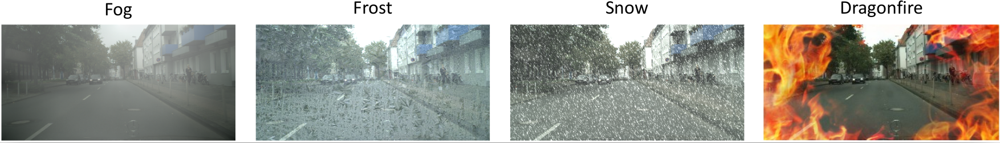

# Robust Detection Benchmark

This repository contains code, data and a benchmark leaderboard from the paper "Benchmarking Corruption Robustness in Object Detection: Autonomous Driving when Winter is Coming" by Claudio Michaelis\*, Benjamin Mitzkus\*, Robert Geirhos\*, Evgenia Rusak\*, Oliver Bringmann, Matthias Bethge & Wieland Brendel.

The core idea is shown here: Real-world applications need to be able to cope with adverse outdoor hazards such as fog, frost, snow (and the occasional dragon fire). The paper benchmarks object detection models on their corruption resilience across a broad range of corruption types.



## Structure & Overview

This repository serves two purposes:

1. Enabling reproducibility. All result figures from the directory ``figures/`` can be generated by executing the analysis notebook in ``data-analysis/`` which uses the data from ``raw-data/``.

2. Hosting the ``Robust Detection Benchmark`` (more information below).

Additionally, we provide three separate modules with functionality that we use in the paper and that we hope may be useful for your own research or applications. They are listed here:

Stylize arbitrary datasets:
https://github.com/bethgelab/stylize-datasets

Corrupt arbitrary datasets:
https://github.com/bethgelab/add-common-image-corruptions

Object detection:
https://github.com/bethgelab/robust_object_detection


## Robust Detection Benchmark

This section shows the most important results on our three benchmark datasets: 
COCO-C, Pascal-C and Cityscapes-C. All models have a fixed ResNet 50 backbone to put the focus on improvements in detection robustness. For more results including ones with different backbones and instance segmentation results please have a look at the [comprehensive results table](TABLE.md).

Results are ranked by their mean performance under corruption (named mCE in the paper). If you achieve state-of-the-art robustness on any of the three datasets with your approach, please open a pull request where you add the results in the table below. We strongly encourage to use backbone listed in the table below, otherwise robustness gains cannot be disentangled from improved overall performance. In your pull request, you will need to indicate the three metrics P, rPC and mPC (as defined in the paper); mPC will then be used to rank your results.


#### Evaluation details

Pascal VOC: Results are evaluated on Pascal VOC 2007 test using the AP50 metric.<br>COCO: Results are evaluated on COCO 2017 val using the mAP50 metric.<br>Cityscapes: Results are evaluated on Cityscapes val using the mAP50 metric.

### Leaderboard


#### Pascal-C 

Rank | Method | Reference | Model  | Backbone  | clean \[P\] | corrupted \[mPC\] | relative \[rPC\] |
:-----:|:-----:|:-----:|:-----:|:---------:|:---------:|:--------------:|:-----:|
\- | baseline                      | Michaelis et al. 2019 | Faster R-CNN | R-50-FPN | 80.5 | 48.6         | 60.4  |
1 |stylizing training data | Michaelis et al. 2019 | Faster R-CNN | R-50-FPN | 80.4 | **56.2** | 69.9 |


#### COCO-C

Rank | Method | Reference | Model  | Backbone  | clean \[P\] | corrupted \[mPC\] | relative \[rPC\] |
:-----:|:-----:|:-----:|:-----:|:---------:|:---------:|:--------------:|:-----:|
\- | baseline                      | Michaelis et al. 2019 | Faster R-CNN | R-50-FPN | 36.3 | 18.2         | 50.2  |
1 |stylizing training data | Michaelis et al. 2019 | Faster R-CNN | R-50-FPN | 34.6 | **20.4** | 58.9 |

#### Cityscapes-C

Rank | Method | Reference | Model  | Backbone  | clean \[P\] | corrupted \[mPC\] | relative \[rPC\] |
:-----:|:-----:|:-----:|:-----:|:---------:|:---------:|:--------------:|:-----:|
\- | baseline                      | Michaelis et al. 2019 | Faster R-CNN | R-50-FPN | 36.4 | 12.2         | 33.4  |
1 |stylizing training data | Michaelis et al. 2019 | Faster R-CNN | R-50-FPN | 36.3 | **17.2** | 47.4 |

## Citation

If you use our code or the benchmark, please consider citing:
```
@article{xyz2019,
  title={xxx},
  author={xyz},
  journal={arXiv:},
  year={2019}
}
```
